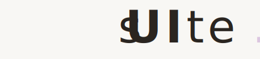

# Suite.jl

<div align="center">
  <picture>
    <source media="(prefers-color-scheme: dark)" srcset="logo/suite_dark.svg">
    <source media="(prefers-color-scheme: light)" srcset="logo/suite_light.svg">
    
  </picture>

  **A UI component library for [Therapy.jl](https://github.com/GroupTherapyOrg/Therapy.jl) inspired by [shadcn/ui](https://ui.shadcn.com/).**

  54 components, 5 themes, dark mode, and a design system built on warm neutrals and Julia brand colors.

  [](https://grouptherapyorg.github.io/Suite.jl/)
  [](LICENSE.md)
</div>

---

## Quick Start

```julia
using Pkg
Pkg.add(url="https://github.com/GroupTherapyOrg/Suite.jl")
```

```julia
import Suite

# A simple card
Suite.Card(
    Suite.CardHeader(
        Suite.CardTitle("Hello, Suite.jl"),
        Suite.CardDescription("A beautiful component library for Julia web apps")
    ),
    Suite.CardContent(
        Suite.Button("Get Started")
    )
)
```

## Components

### Layout

| Component | Exports |
|-----------|---------|
| **Card** | `Card`, `CardHeader`, `CardTitle`, `CardDescription`, `CardContent`, `CardFooter` |
| **AspectRatio** | `AspectRatio` |
| **Separator** | `Separator` |
| **Resizable** | `ResizablePanelGroup`, `ResizablePanel`, `ResizableHandle` |
| **ScrollArea** | `ScrollArea` |

### Data Display

| Component | Exports |
|-----------|---------|
| **Table** | `Table`, `TableHeader`, `TableBody`, `TableFooter`, `TableRow`, `TableHead`, `TableCell`, `TableCaption` |
| **DataTable** | `DataTable`, `DataTableColumn` |
| **Badge** | `Badge` |
| **Avatar** | `Avatar`, `AvatarImage`, `AvatarFallback` |
| **Calendar** | `Calendar`, `DatePicker` |
| **CodeBlock** | `CodeBlock` |
| **TreeView** | `TreeView`, `TreeViewItem` |
| **Carousel** | `Carousel`, `CarouselContent`, `CarouselItem`, `CarouselPrevious`, `CarouselNext` |
| **Skeleton** | `Skeleton` |
| **Empty** | `Empty`, `EmptyIcon`, `EmptyTitle`, `EmptyDescription`, `EmptyAction` |
| **Typography** | `H1`, `H2`, `H3`, `H4`, `P`, `Blockquote`, `InlineCode`, `Lead`, `Large`, `Small`, `Muted` |

### Forms & Input

| Component | Exports |
|-----------|---------|
| **Button** | `Button` |
| **Input** | `Input` |
| **Textarea** | `Textarea` |
| **Label** | `Label` |
| **Select** | `Select`, `SelectTrigger`, `SelectValue`, `SelectContent`, `SelectGroup`, `SelectLabel`, `SelectItem` |
| **Switch** | `Switch` |
| **Slider** | `Slider` |
| **Toggle** | `Toggle` |
| **ToggleGroup** | `ToggleGroup`, `ToggleGroupItem` |
| **Form** | `Form`, `FormField`, `FormItem`, `FormLabel`, `FormControl`, `FormDescription`, `FormMessage` |

### Feedback

| Component | Exports |
|-----------|---------|
| **Alert** | `Alert`, `AlertTitle`, `AlertDescription` |
| **AlertDialog** | `AlertDialog`, `AlertDialogTrigger`, `AlertDialogContent`, `AlertDialogHeader`, `AlertDialogFooter`, `AlertDialogTitle`, `AlertDialogDescription`, `AlertDialogAction`, `AlertDialogCancel` |
| **Dialog** | `Dialog`, `DialogTrigger`, `DialogContent`, `DialogHeader`, `DialogFooter`, `DialogTitle`, `DialogDescription`, `DialogClose` |
| **Toast** | `Toaster` |
| **Progress** | `Progress` |
| **Spinner** | `Spinner` |
| **HoverCard** | `HoverCard`, `HoverCardTrigger`, `HoverCardContent` |
| **Tooltip** | `TooltipProvider`, `Tooltip`, `TooltipTrigger`, `TooltipContent` |
| **Popover** | `Popover`, `PopoverTrigger`, `PopoverContent` |

### Navigation

| Component | Exports |
|-----------|---------|
| **NavigationMenu** | `NavigationMenu`, `NavigationMenuList`, `NavigationMenuItem`, `NavigationMenuTrigger`, `NavigationMenuContent`, `NavigationMenuLink` |
| **Breadcrumb** | `Breadcrumb`, `BreadcrumbList`, `BreadcrumbItem`, `BreadcrumbLink`, `BreadcrumbPage`, `BreadcrumbSeparator` |
| **Tabs** | `Tabs`, `TabsList`, `TabsTrigger`, `TabsContent` |
| **Menubar** | `Menubar`, `MenubarMenu`, `MenubarTrigger`, `MenubarContent`, `MenubarItem`, `MenubarSeparator` |
| **DropdownMenu** | `DropdownMenu`, `DropdownMenuTrigger`, `DropdownMenuContent`, `DropdownMenuItem`, `DropdownMenuSeparator` |
| **ContextMenu** | `ContextMenu`, `ContextMenuTrigger`, `ContextMenuContent`, `ContextMenuItem` |
| **Command** | `Command`, `CommandInput`, `CommandList`, `CommandEmpty`, `CommandGroup`, `CommandItem` |
| **Pagination** | `Pagination`, `PaginationContent`, `PaginationItem`, `PaginationLink`, `PaginationPrevious`, `PaginationNext` |

### Overlay & Surface

| Component | Exports |
|-----------|---------|
| **Sheet** | `Sheet`, `SheetTrigger`, `SheetContent`, `SheetHeader`, `SheetFooter`, `SheetTitle`, `SheetDescription` |
| **Drawer** | `Drawer`, `DrawerTrigger`, `DrawerContent`, `DrawerHeader`, `DrawerFooter`, `DrawerTitle`, `DrawerDescription` |
| **Accordion** | `Accordion`, `AccordionItem`, `AccordionTrigger`, `AccordionContent` |
| **Collapsible** | `Collapsible`, `CollapsibleTrigger`, `CollapsibleContent` |

### Site Components

| Component | Exports |
|-----------|---------|
| **SiteFooter** | `SiteFooter`, `FooterBrand`, `FooterLinks`, `FooterLink`, `FooterTagline` |
| **SiteNav** | `SiteNav` |
| **ThemeToggle** | `ThemeToggle` |
| **ThemeSwitcher** | `ThemeSwitcher` |
| **StatusBar** | `StatusBar`, `StatusBarSection`, `StatusBarItem` |
| **Toolbar** | `Toolbar`, `ToolbarGroup`, `ToolbarSeparator` |
| **Kbd** | `Kbd` |

## Theme System

Suite.jl includes 5 built-in themes with automatic dark mode support:

| Theme | Accent | Description |
|-------|--------|-------------|
| `default` | Purple | Warm scholarly tones |
| `ocean` | Blue | Cool and professional |
| `minimal` | Zinc | Sharp, monospace-friendly |
| `nature` | Emerald | Organic earthy tones |
| `islands` | Blue-gray | Floating glass panels |

Themes use CSS custom properties and can be switched at runtime:

```julia
# Dark/light mode toggle
Suite.ThemeToggle()

# Theme palette switcher
Suite.ThemeSwitcher()
```

### Design System

All components use a shared design system built on:

- **Warm neutrals** (`warm-50` through `warm-950`) for backgrounds, borders, and text
- **Accent colors** for interactive elements only (links, buttons, active states)
- **Julia brand colors** for the `.jl` wordmark: Blue `#4063d8`, Green `#389826`, Purple `#9558b2`, Red `#cb3c33`

## Usage with Therapy.jl

Suite.jl is designed for [Therapy.jl](https://github.com/GroupTherapyOrg/Therapy.jl) applications. All components return standard Therapy.jl VNodes:

```julia
using Therapy
import Suite

function MyPage()
    Fragment(
        Suite.Alert(variant="default",
            Suite.AlertTitle("Welcome"),
            Suite.AlertDescription("This is a Suite.jl alert component.")
        ),

        Suite.Tabs(value="code",
            Suite.TabsList(
                Suite.TabsTrigger(value="code", "Code"),
                Suite.TabsTrigger(value="preview", "Preview"),
            ),
            Suite.TabsContent(value="code",
                Suite.CodeBlock("println(\"Hello!\")", language="julia")
            ),
            Suite.TabsContent(value="preview",
                Suite.P("Hello!")
            )
        )
    )
end
```

## Requirements

- Julia 1.12+
- [Therapy.jl](https://github.com/GroupTherapyOrg/Therapy.jl)
- [WasmTarget.jl](https://github.com/GroupTherapyOrg/WasmTarget.jl) (for interactive island components)

## Documentation

Full documentation with live examples: **https://grouptherapyorg.github.io/Suite.jl/**

## License

MIT — see [LICENSE.md](LICENSE.md)
