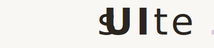

# Suite.jl

<div align="center">
  <picture>
    <source media="(prefers-color-scheme: dark)" srcset="logo/suite_dark.svg">
    <source media="(prefers-color-scheme: light)" srcset="logo/suite_light.svg">
    
  </picture>

  **A [shadcn/ui](https://ui.shadcn.com/)-inspired component library for Julia web apps built with [Therapy.jl](https://github.com/GroupTherapyOrg/Therapy.jl).**

  [](https://grouptherapyorg.github.io/Suite.jl/)
  [](LICENSE.md)
</div>

---

Suite.jl gives you 54 pre-built, themed UI components that work with Therapy.jl's three-tier component model. Every component uses warm neutrals + accent colors, supports dark mode, and can be extracted into your project so you own the code.

## Quick Start

```julia
using Pkg
Pkg.add(url="https://github.com/GroupTherapyOrg/Suite.jl")
```

```julia
import Suite

Suite.Card(
    Suite.CardHeader(
        Suite.CardTitle("Hello, Suite.jl"),
        Suite.CardDescription("A component library for Julia web apps")
    ),
    Suite.CardContent(
        Suite.Button("Get Started")
    )
)
```

## Three Component Tiers

Suite.jl components span Therapy.jl's three tiers:

### Static Components — HTML + Tailwind, zero JavaScript

```julia
Suite.Card(Suite.CardContent(Suite.Badge("New"), Suite.P("Hello")))
Suite.Alert(Suite.AlertTitle("Warning"), Suite.AlertDescription("Check this"))
```

Button, Badge, Card, Alert, Avatar, Input, Label, Table, Separator, Progress, Skeleton, Typography, and more.

### Island Components — compiled to WebAssembly, interactive on the client

```julia
Suite.Tabs(value="code",
    Suite.TabsList(
        Suite.TabsTrigger(value="code", "Code"),
        Suite.TabsTrigger(value="preview", "Preview"),
    ),
    Suite.TabsContent(value="code", "println(\"Hello\")"),
    Suite.TabsContent(value="preview", "Hello")
)
```

Accordion, Calendar, Carousel, CodeBlock, Collapsible, Command, Dialog, Drawer, DropdownMenu, Form, HoverCard, Menubar, NavigationMenu, Popover, Resizable, Select, Sheet, Slider, Switch, Tabs, ThemeToggle, ThemeSwitcher, Toggle, ToggleGroup, Tooltip, and more.

All interactivity compiles to Wasm via `@island` — zero hand-written JavaScript.

## Themes

5 built-in themes with automatic dark mode:

| Theme | Accent | Style |
|-------|--------|-------|
| `default` | Purple | Warm scholarly tones |
| `ocean` | Blue | Cool and professional |
| `minimal` | Zinc | Sharp, monospace-friendly |
| `nature` | Emerald | Organic earthy tones |
| `islands` | Blue-gray | Floating glass panels |

```julia
Suite.ThemeToggle()     # Dark/light mode
Suite.ThemeSwitcher()   # Switch between themes
```

## Extraction (Own the Code)

Like shadcn/ui, you can extract any component into your project and customize it:

```julia
Suite.extract(:Button)                    # Copy Button.jl to ./components/
Suite.extract(:Dialog)                    # Includes dependencies automatically
Suite.extract(:Button; theme=:ocean)      # Apply theme during extraction
Suite.list()                              # See all 54 components
Suite.info(:Dialog)                       # Show deps, tier, exports
```

## All Components

| Category | Components |
|----------|------------|
| **Layout** | Card, AspectRatio, Separator, Resizable, ScrollArea |
| **Data Display** | Table, DataTable, Badge, Avatar, Calendar, CodeBlock, TreeView, Carousel, Skeleton, Empty, Typography |
| **Forms** | Button, Input, Textarea, Label, Select, Switch, Slider, Toggle, ToggleGroup, Form |
| **Feedback** | Alert, AlertDialog, Dialog, Toast, Progress, Spinner, HoverCard, Tooltip, Popover |
| **Navigation** | NavigationMenu, Breadcrumb, Tabs, Menubar, DropdownMenu, ContextMenu, Command, Pagination |
| **Overlay** | Sheet, Drawer, Accordion, Collapsible |
| **Site** | SiteFooter, SiteNav, ThemeToggle, ThemeSwitcher, StatusBar, Toolbar, Kbd |

## Requirements

- Julia 1.12+
- [Therapy.jl](https://github.com/GroupTherapyOrg/Therapy.jl)
- [WasmTarget.jl](https://github.com/GroupTherapyOrg/WasmTarget.jl) (for island components)

## Documentation

Full docs with live examples: **https://grouptherapyorg.github.io/Suite.jl/**

## License

MIT — see [LICENSE.md](LICENSE.md)
